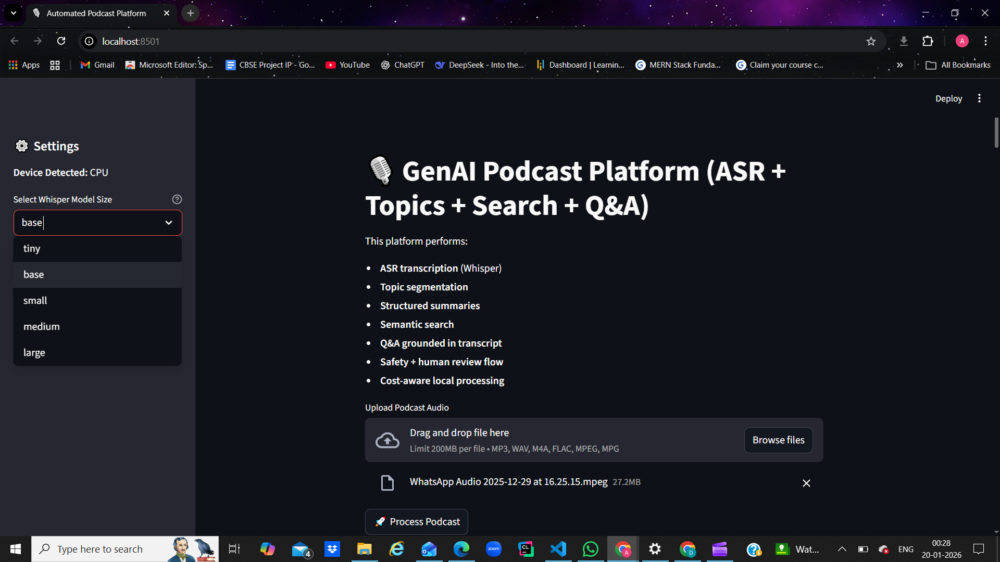
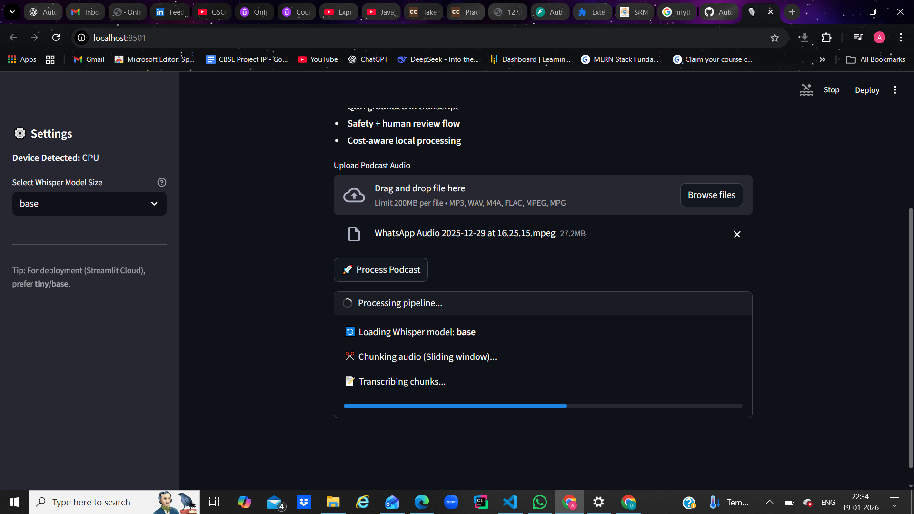
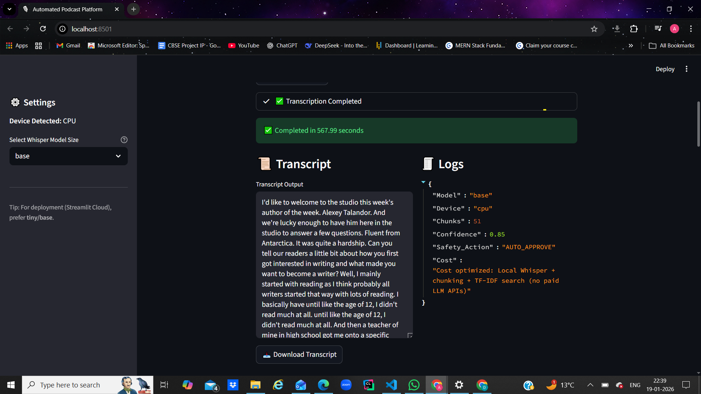
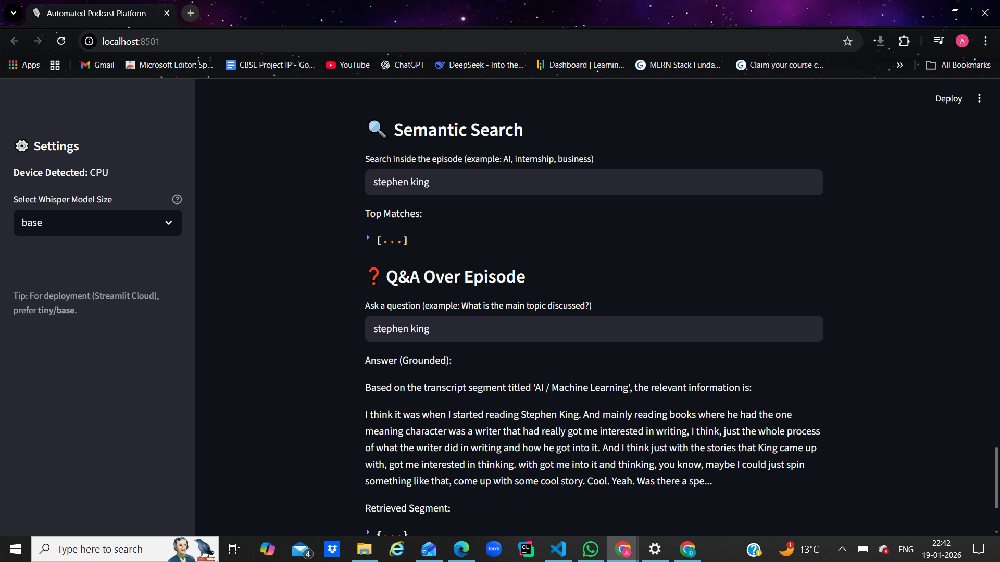
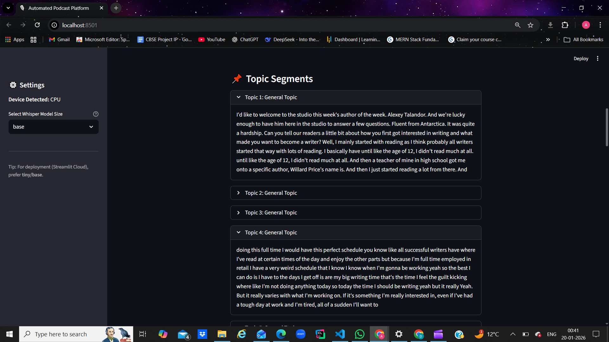
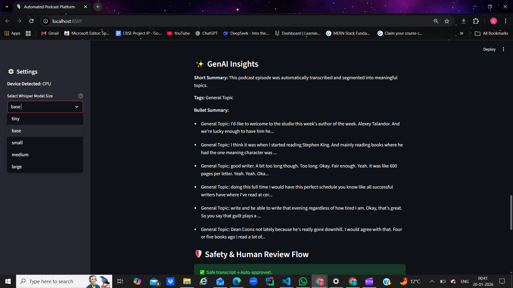

# Automated Podcast Transcription & Topic Segmentation (GenAI Internship Lab)

## Problem
This project converts long-form podcast audio into structured, searchable, topic-wise knowledge.
It automates:
- Audio ingestion
- Transcription (ASR)
- Topic segmentation
- Structured summary and insights
- Semantic search and Q&A style retrieval
- Safety handling and human review flow

## Architecture
System flow:

Upload Audio
-> Chunking (Sliding Window)  
-> Whisper Transcription (ASR)  
-> Text Cleaning  
-> Topic Segmentation  
-> Auto Topic Titles (TF-IDF keywords)  
-> Summary + Tags  
-> Semantic Search (TF-IDF retrieval)  
-> Safety + Confidence Scoring    
-> Human Review Decision (if needed)  
-> Final JSON Output + Download  

## Tech Stack
- **ASR:** OpenAI Whisper (local)  
- **Topic Segmentation:** Word-based segmentation + TF-IDF keyword titles  
- **Semantic Search:** TF-IDF similarity search (no paid vector DB)  
- **GenAI Feature:** Structured summary, topic-wise output, tagging  
- **UI:** Streamlit  
- **Audio Processing:** pydub  
- **Language:** Python  

## Pipeline
Audio -> Transcription -> Cleaning -> Segmentation -> GenAI Insights -> Output

## Prompt Strategy
This project is cost-optimized and does not use paid LLM APIs.
Instead of external LLM calls, it uses:
- TF-IDF keyword extraction for topic titles
- Structured summarization logic
This reduces prompt injection risk and keeps the pipeline offline-friendly.

## Safety Handling
Safety layer includes:
- Basic sensitive content detection (flagging)
- Confidence scoring
- Auto-approve vs human review decision

Decision rules:
- If safe and confidence is high -> AUTO_APPROVE
- If unsafe or confidence is low -> NEEDS_HUMAN_REVIEW

## Cost Optimization
Cost-aware design choices:
- Local Whisper transcription (no paid ASR API)
- Chunking for long audio handling (memory and speed optimization)
- TF-IDF semantic search instead of paid vector database

## Human-in-the-Loop
Human validation is required when:
- safety flags are triggered
- confidence score is below threshold
The system marks output as NEEDS_HUMAN_REVIEW.

## How to Run

Step 1: Clone your fork
```bash
    git clone https://github.com/Aanchal-Jagga/Automated-podcast.git
    cd Automated-podcast
```
Step 2: Create and activate virtual environment
```bash
python -m venv venv
venv\Scripts\activate
```

Step 3: Install dependencies
```
pip install -r Intern_Submissions/Aanchal_Jagga/requirements.txt

```
Step 4: Run Streamlit app
```
streamlit run Intern_Submissions/Aanchal_Jagga/app.py
```

## Sample Output

Sample output JSON is available at:
Intern_Submissions/Aanchal_Jagga/outputs/result.json

## Demo

### Screenshots

  
  
  
   



Demo video link: https://drive.google.com/file/d/1QYMn_PxymVlMvJ9gu_8GGApnVGgsXJ3w/view?usp=sharing
