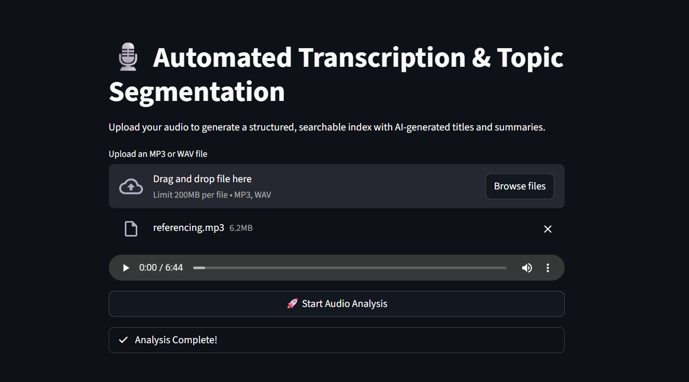
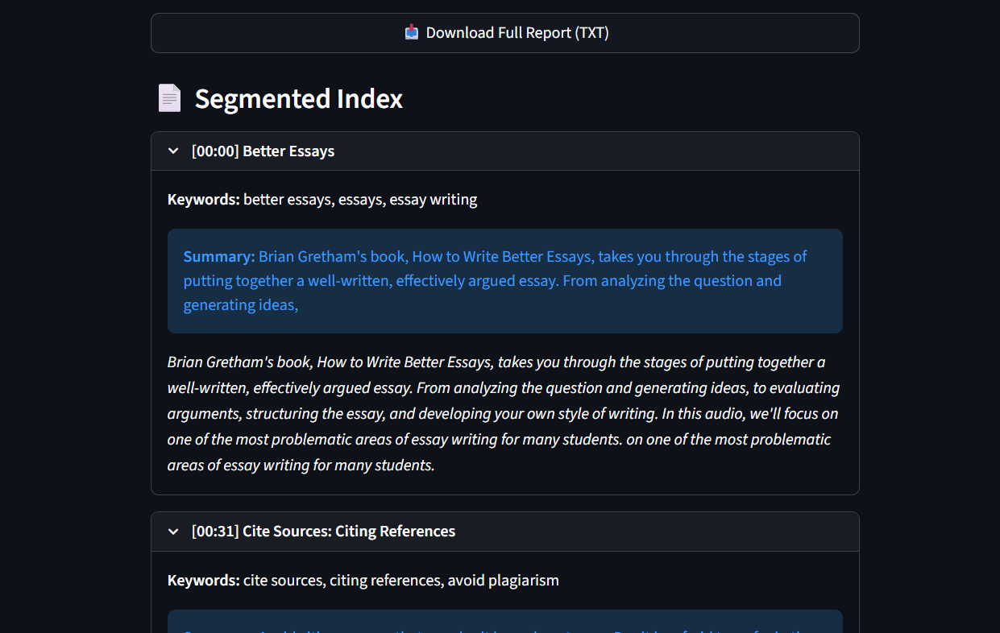
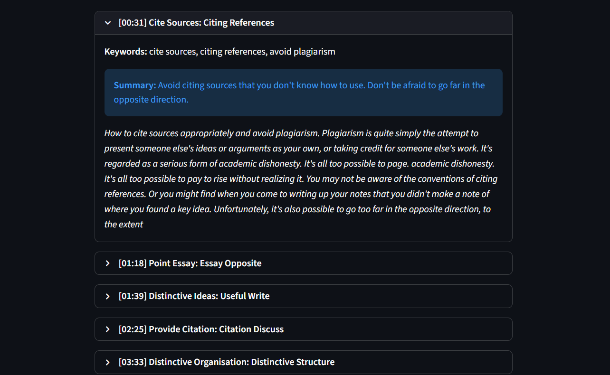

# Automated Transcription and Topic Segmentation

## Problem
Podcast and long-form audio are often difficult to navigate or search for specific information. This system converts raw audio into a structured, searchable index by automatically segmenting topics and generating GenAI-powered titles and summaries.

---

## Architecture
The system follows a modular pipeline where each component is isolated for scalability.

**Audio Engine**  
Acts as the ingestion layer. It standardizes raw audio by resampling to **16kHz Mono** and converting it to the **WAV** format, ensuring consistent performance across different input file types (MP3, M4A, etc.).

**Transcription Engine**  
Utilizes **OpenAI Whisper-Small**. To handle long-form audio without losing context or crashing memory, it implements a **sliding window approach** (30s chunks with a 5s overlap). This ensures that sentences cut off at the edge of one window are captured fully in the next.

**NLP & Semantic Engine**  
This is the intelligence layer. It first performs **deduplication** on overlapping window text to provide a clean transcript. It then uses **Sentence-Transformers (all-MiniLM-L6-v2)** to calculate semantic similarity between chunks, identifying **topical boundaries** where the conversation naturally shifts.

**GenAI Insights Engine**  
The final refinement layer. Segmented topics are passed into **Google FLAN-T5-Base**, which performs:
- Zero-shot topic labeling  
- Abstractive summarization into concise bullet points  

---

## Tech Stack
- **ASR (Transcription):** OpenAI Whisper-Small (local execution via HuggingFace)  
- **LLM (Insights):** Google FLAN-T5-Base  
- **Vector Embeddings:** Sentence-Transformers (all-MiniLM-L6-v2)  
- **Audio Processing:** Librosa (16kHz resampling & normalization)  
- **UI / Backend:** Streamlit  

---

## Pipeline

**Audio Ingestion** → **16kHz Resampling** → **Whisper Transcription** → **Text Cleaning & Deduplication** → **Semantic Segmentation (Vector Similarity)** → **GenAI Labeling & Summarization (FLAN-T5)** → **Streamlit UI Rendering**

---

## Prompt Strategy
The system uses a **Hybrid Labeling Strategy** combining extractive grounding with abstractive generation.

- **Extractive Layer:**  
  KeyBERT extracts high-confidence keywords directly from the transcript. These keywords act as factual anchors.

- **Abstractive Layer:**  
  FLAN-T5-Base generates human-readable titles and summaries using contextual understanding.

- **Context Injection:**  
  The first **300 characters** of each segment are injected into the prompt for relevance.

- **Style Constraints:**  
  Prompts enforce **noun-phrase-only titles** and avoid verbs for professional indexing.

- **Repetition Penalty:**  
  A repetition penalty of **4.5** prevents prompt echoing and redundant phrasing.

---

## Safety Handling
- **Hallucination Control:**  
  Generated titles are validated using heuristic rules. If a title is too short or excessively long, the system falls back to a deterministic keyword-based title generated from KeyBERT.

- **Data Privacy:**  
  All models (Whisper, FLAN-T5, MiniLM) run **locally**. No audio or transcript data is sent to external APIs.

- **Decoder Constraints:**  
  `max_new_tokens=440` is enforced to prevent runaway generation and memory crashes.

---

## Cost Optimization
- **Local Inference:**  
  No external API calls — zero LLM usage cost.

- **Resource Caching:**  
  Heavy models are cached using `@st.cache_resource` to avoid redundant reloads.

- **Audio Downsampling:**  
  Resampling to **16kHz** significantly reduces transformer compute cost.

---

## Human-in-the-Loop
- **Interactive Index:**  
  Users can expand/collapse segments to compare AI summaries with original transcripts.

- **Transparency:**  
  Extracted keywords are displayed alongside each segment for validation.

- **Validation:**  
  Original transcript text is shown under each generated title for quick review.

- **Export Flow:**  
  Users can download the structured index as a `.txt` file for final manual editing or archival.

---

## How to Run

1. **Clone the repository**: git clone <https://github.com/m-aparna108/Automated-podcast.git>
2. **Navigate to folder**
: cd Intern_Submissions/Aparna_M/

3.**Install dependencies**: pip install -r requirements.txt

4.**Run the application**: streamlit run app.py

## Demo Screenshots

### 1. Audio Upload

### 2. Transcription 

